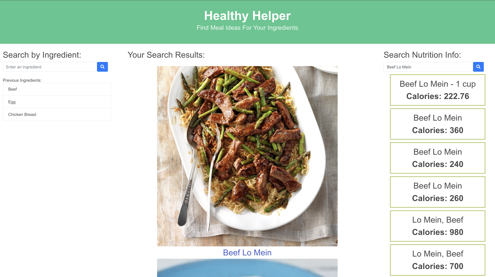

# **Healthy Helper**

## Purpose
The purpose of this project is to help inspire users to find meal recipes based on the ingredients available in their kitchen and review respective recipe's nutritional infromation.

## Objectives
```md
GIVEN I am hungry
WHEN I input my ingredient
THEN I will find recipes that contain the ingredient and able to search for the nutritional info
```

### **Acceptance Criteria**

GIVEN I enter an ingredient
- [ ] WHEN I open the recipe information
<br>THEN I am presented with a list of recipes that contain the ingredient searches for

- [ ] WHEN I click on a recipe
<br>THEN I am presented with a MODAL that includes total required ingredients and cooking instructions

- [ ] WHEN I click on the food
<br>THEN I can see the nutritional information

- [ ] WHEN I click the search button
<br>THEN the text for that ingredient is saved in local storage

- [ ] WHEN I refresh the page
<br>THEN the saved events persist


### **Additional Criteria**

**Technical: 25%**
- [ ] Application uses at least two server-side APIs.
- [ ] Application uses client-side storage to store persistent data.
- [ ] Application doesn't use JS alerts, prompts, or confirms (uses modals instead).
- [ ] Application uses a CSS framework other than Bootstrap.
- [ ] Application is interactive (accepts and responds to user input).

**Concept: 10%**
- [ ] Application should be a unique and novel idea.
- [ ] Your group should clearly and concisely articulate your project idea.

**Deployment: 20%**
- [ ] Application deployed at live URL and loads with no errors.
- [ ] Application GitHub URL submitted.
- [ ] Portfolio at live URL submitted, featuring project.

**Repository Quality: 10%**
- [ ] Repository has a unique name
- [ ] Repository follows best practices for file structure and naming conventions
- [ ] Repository follows best practices for class/id naming conventions, indentation, quality comments, etc.
- [ ] Repository contains multiple descriptive commit messages
- [ ] Repository contains quality README.md with description, screenshots, link to deployed application

**Application Quality: 15%**
- [ ] Application user experience is intuitive and easy to navigate.
- [ ] Application user interface style is clean and polished.
- [ ] Application is responsive.

**Presentation: 10%**
- [ ] Your group should present using Powerpoint or a similar presentation software.
- [ ] Every group member should speak during the presentation.
- [ ] Your presentation should follow the Project Presentation Template.

**Collaboration: 10%**
- [ ] There are no major disparities in the number of GitHub contributions between group members.

### Mock-Up



### Website
https://sam-pettyjohn.github.io/healthy-helper/

## Table of Contents

- [Healthy Helper](#healthy-helper)
  - [Purpose](#purpose)
  - [Objectives](#objectives)
    - [**Acceptance Criteria**](#acceptance-criteria)
    - [**Additional Criteria**](#additional-criteria)
    - [**Mock-Up**](#mock-up)
  - [Table of Contents](#table-of-contents)
  - [Languages](#built-with)
  - [Installation](#installation)
  - [Usage](#usage)
  - [Credits](#credits)
  - [License](#license)

## Built With

- HTML
- CSS
    - CSS Frameworks [Bulma](https://bulma.io/documentation/) & [Bootstrap](https://getbootstrap.com/docs/4.0/getting-started/introduction/)
- JavaScript
    - [jQuery](https://api.jquery.com/)

*With an emphasis utilizing server-side APIs. For this project, we are utilizing [TheMealDB](https://www.themealdb.com/api.php) and [NutritionIX](https://docs.google.com/document/d/1_q-K-ObMTZvO0qUEAxROrN3bwMujwAN25sLHwJzliK0/edit#heading=h.jpcgv4yap78u).*

## Credits

You may visit my [GitHub] profile to view my previous and most recent projects.

## Collaborators

- James Huang
- Adriana Pena
- Sam Pettyjohn

## License
MIT License

Copyright (c) 2022 

Permission is hereby granted, free of charge, to any person obtaining a copy
of this software and associated documentation files (the "Software"), to deal
in the Software without restriction, including without limitation the rights
to use, copy, modify, merge, publish, distribute, sublicense, and/or sell
copies of the Software, and to permit persons to whom the Software is
furnished to do so, subject to the following conditions:

The above copyright notice and this permission notice shall be included in all
copies or substantial portions of the Software.

THE SOFTWARE IS PROVIDED "AS IS", WITHOUT WARRANTY OF ANY KIND, EXPRESS OR IMPLIED, INCLUDING BUT NOT LIMITED TO THE WARRANTIES OF MERCHANTABILITY, FITNESS FOR A PARTICULAR PURPOSE AND NONINFRINGEMENT. IN NO EVENT SHALL THE AUTHORS OR COPYRIGHT HOLDERS BE LIABLE FOR ANY CLAIM, DAMAGES OR OTHER LIABILITY, WHETHER IN AN ACTION OF CONTRACT, TORT OR OTHERWISE, ARISING FROM, OUT OF OR IN CONNECTION WITH THE SOFTWARE OR THE USE OR OTHER DEALINGS IN THE SOFTWARE.